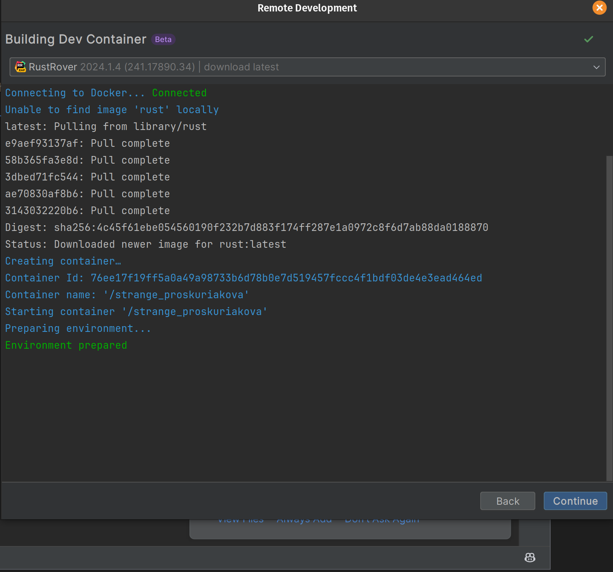
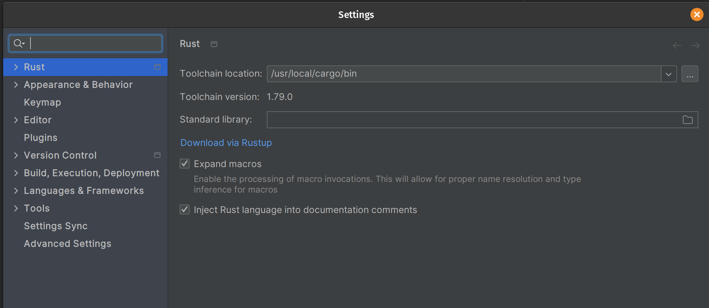
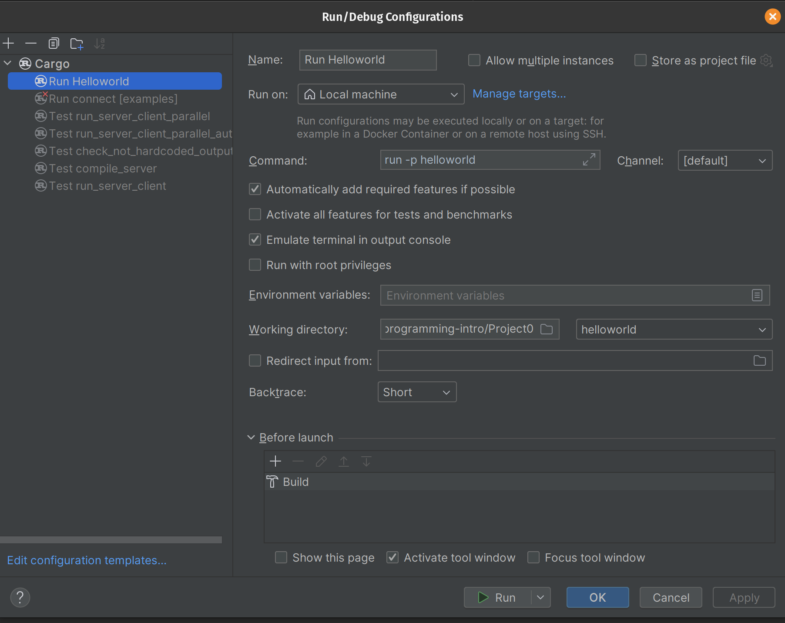
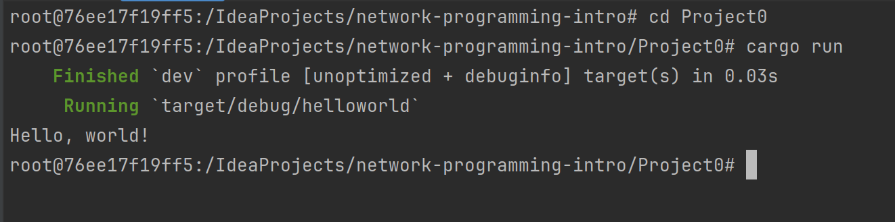
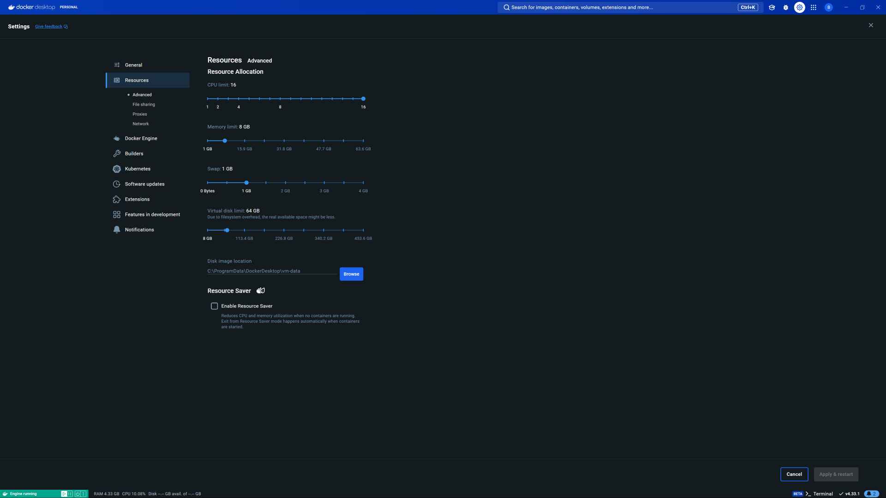

Goal: Set up an Ubuntu Docker container and development environment

### Why Linux?

- It makes the life of a systems programmer much easier. In this course, we need low-level control over things that the operating system and/or networking hardware are usually responsible far. With a sandboxed Linux environment, we can have that control. 
- It will ensure that all of you have the same software packages, meaning that if something weird is going on, it's almost certainly to do with the code that you've written.
- It will teach you more about operating systems without you realizing it.
- Nearly every server in the world is running Linux. It is the backbone of networking infrastructure.

## Instructions

- Note: even if you are daily-driving Linux as your boot OS, follow these instructions. By developing within this container, you can avoid lots of "noisy" (in the non-technical sense) network traffic. This will make later projects easier to debug.

### Setup
- Install and launch [RustRover](https://www.jetbrains.com/rust/)
	- You don't *have* to use this IDE, but it will make life easier and allow me to support you better if you run into problems
- Install [Docker](https://docs.docker.com/engine/install/)
	- If you prefer a GUI, install [Docker Desktop](https://docs.docker.com/desktop/)
- Start the Docker daemon
	- On Linux: `systemctl start docker` or `sudo dockerd`
	- Other platforms may have different commands
- Open your project in RustRover
- Click File > Remote Development
- -> Create dev container
- -> From Local Project
- Click the folder icon and select the path to `[PROJECT DIRECTORY]/.devcontainer/devcontainer.json`
- -> Build container and continue
	- If having permissions issues, try:
		- `sudo chmod a+rwx /var/run/docker.sock`
		- `sudo chmod a+rwx /var/run/docker.pid`
	- This will pull down a Docker image that I put together for this course. It has all the networking utilities you could want, plus a Rust toolchain.
	- 
	- In the future, when you start up Rust Rover and click Remote Development, you don't have to create the dev container again. Just click Dev Containers and select the one that you already made.
- Accept any user agreement pop-ups
- This will launch you into a new RustRover window that is connected to your Docker container via SSH. Here, you have a new filesystem, so things might be moved around.
- You may have to manually set your Rust Toolchain location. Mine was at `/usr/local/cargo/bin`
	- You can find yours by running `whereis cargo` in the shell
	- 

### Running the program
- In RustRover, find the `main.rs` file for Project0
- Create a run configuration for Project0 as follows, and execute it
	- 
	- Alternatively, you can open up a shell (within RustRover), `cd` into Project0, and execute `cargo run`
	- 

## What to submit
- On your version of this repository, edit the README here to include the following:
	- A screenshot of your RustRover window
	- A screenshot showing the "Hello, world!" output
 - If you are having trouble, you can submit your screenshots on Teams as a backup

## Misc.
- You can install rustfmt for autoformatting with `rustup component add rustfmt`
	- You have to change your RustRover settings to enable code cleanup on save, and to use rustfmt instead of the built-in formatter
- Consult [RustRover instructions](https://www.jetbrains.com/help/rust/connect-to-devcontainer.html#start_from_gateway) for more information, if needed
- If you're on a Mac with Apple Silicon, make sure your operating system is up to date
- If you're on Windows and you're getting a low-memory error while trying to start the Docker container, you might be able to fix this by going into Docker Desktop settings, disable resource optimization, and increasing the memory allocation.
  

